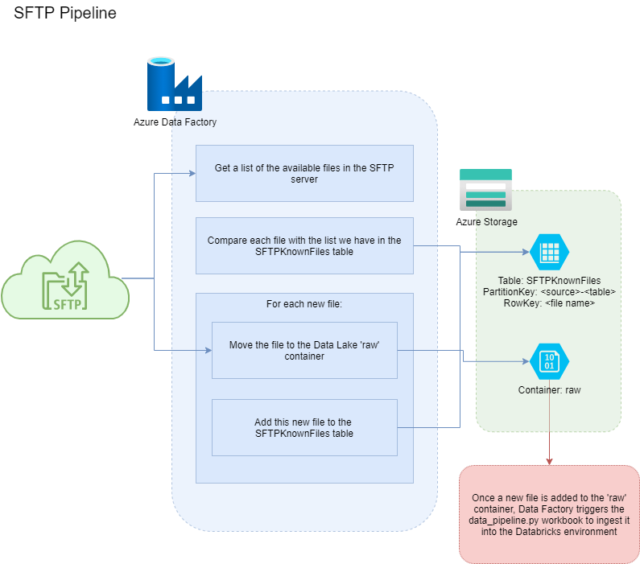

# Ingenii Azure Data Factory Generator Usage

## Connections

These are the different connection types that this package supports drawing data from.

### <a name="general_requirements"></a>General requirements

If not using the Ingenii Azure Data Platform, then there are some resources that need to be created ahead of using this package, as these are assumed to exist already. The below are used by all different pipelines.

1. A key vault linked service called `Credentials Store`, where credentials and secrets are drawn from. 
    1. It's recommended that the Data Factory managed identity is used to connect to the Key Vault
    1. The Data Factory requires `Get` credentials to the `Secrets` key vault type.
1. A data lake linked service called `Data Lake`:
    1. In the data lake itself, a container called `raw` which the files will be copied to

### FTP/SFTP

#### Requirements

As well as those listed in the [General requirements](#general_requirements), these are specific to the FTP/SFTP pipelines that should be created ahead of time:

1. Add to the data lake referenced by the linked service `Data Lake`:
    1. A table in table storage called `KnownSFTPFiles` where we keep track of which files have been processed
    1. A table called `Select1`, with an entry with PartitionKey `1` and RowKey `1`, for adding new entries to the `KnownSFTPFiles` table
1. Add to the key vault referenced by the linked service `Credentials Store`:
    1. The server password as a secret, with the name you have given in the config JSON at `config.key_vault_secret_name`
    1. A [SAS token](https://docs.microsoft.com/en-us/azure/storage/common/storage-sas-overview) that grants access to the table storage in the data lake referenced by the linked service `Data Lake`.
        1. [Guide to creating a SAS token manually](https://docs.microsoft.com/en-us/azure/cognitive-services/translator/document-translation/create-sas-tokens?tabs=Containers)
        1. `Allowed services` should be restricted to `Table`
        1. `Allowed resource types` should be restricted to `Object`
        1. All possible permissions should be added
        1. Change the expiration data to be a long time in the future (e.g. 2100-01-01)
        1. Once the token is created, copy the `Table service SAS URL` version, which starts with `https://`
        1. Add this to the Key Vault with the secret name `datalake-table-storage-sas-uri`

#### Example configuration
```
{
    "name": "example-data-provider",
    "connection": "ftp",
    "authentication": "basic",
    "self_hosted_integration_runtime": "adp-self-hosted",
    "config": {
        "host": "hostaddress.com",
        "username": "username-321",
        "key_vault_secret_name": "example-data-provider-password"
    },
    "schedule": {
        "frequency": "Day",
        "time": "06:00"
    },
    "tables": [
        {
            "name": "table1",
            "path": "/path1"
        }
    ]
}
```
| Key | Required | Description |
| --- | --- | --- |
| `name` | Yes | The name of the data provider that we are pulling data from. This will be used in naming Data Factory resources such as pipelines, and is the top-level folder name in the `raw` container in the data lake that the files will be copied to. |
| `connection` | Yes | The connection type to use, in this case either `ftp` or `sftp`. This will set which protocol is used and the default port the pipeline will connect to: `21` for `ftp` and `22` for `sftp`. The port can be overridden with the `custom_port` argument in the `config` block detailed below. |
| `authentication` | Yes | The authentication to be used to connect to the server. Currently only `basic` is supported. |
| `self_hosted_integration_runtime` | No | If we need to use a self-hosted integration runtime to connect to the remote server, for example to use a fixed IP address, then the name of the runtime to use should be given here, which needs to be created ahead of time. If this entry is not provided then an Azure-provided integration runtime will be used. |
| `config` | Yes | The configuration to connect to the remote server. |
| `config.hostname` | Yes | The hostname of the remote server. |
| `config.username` | Yes | The username to use to connect to the remote server. |
| `config.key_vault_secret_name` | Yes | The password to connect to is sensitive, so we cannot specify it here. Instead, we hold the password as a secret in an Azure Key Vault, and the pipeline obtains it at runtime: it will access a Key Vault linked service called `Credentials Store` (as described in the General Requirements section) and get the secret with the name specified here. |
| `schedule` | Yes | How often the pipeline will check the remote server. See the `Triggers` section below to see all the ways this can be configured. |
| `tables` | Yes | The list of tables that we should pull from the remote server into the data lake `raw` container. |
| `tables.name` | Yes | The name of the table the server files correspond to. This will both be the name of the table in the Databricks database, and part of the folder path in the data lake `raw` container that the files will be copied to: the full path will be `<data provider name>/<table name>`. |
| `tables.path` | Yes | The path on the remote server to draw files from. All files found at this path will be copied. Currently, there is no filtering configuration options and the search is non-recursive. |

#### Process



## Triggers

As well as defining the pipeline itself, we need to define when it runs. At the moment only the 'Schedule' type of trigger has been implemented [out of the types available.](https://docs.microsoft.com/en-us/azure/data-factory/concepts-pipeline-execution-triggers)

All times are UTC. The option to change timezone has not yet been implemented.

### Recurrence

The most simple schedule is recurringly calling the pipeline after a fixed interval. The different approaches are:

```
    # Runs every 15 minutes
    "schedule": {
        "frequency": "Minute",
        "interval": "15"
    }

    # Runs every 3 hours
    "schedule": {
        "frequency": "Hour",
        "interval": "3"
    }

    # Runs every day at 6:00 AM
    "schedule": {
        "frequency": "Day",
        "time": "06:00"
    }

    # Daily frequency is assumed, so runs every day at 3:00 PM
    "schedule": {
        "time": "15:00"
    }

    # Daily frequency is assumed, so runs every day at 6:00 AM and 5:00 PM
    "schedule": {
        "hours": [6, 17]
    }
```

### Days of the week

Another approach is to set the days of the week the pipeline will run, and at which time. Times follow a cron-like approach where hours and minutes are set separately, and all combinations are run.

```
    # Runs every Tuesday, Thursday, and Sunday at 6:00 AM
    "schedule": {
        "hours": [6],
        "weekDays": [
            "Tuesday",
            "Thursday",
            "Sunday"
        ]
    }

    # Runs every Monday and Thursday, at 6:15, 6:30, 12:15, 12:30
    "schedule": {
        "hours": [6, 12],
        "minutes": [15, 30],
        "weekDays": [
            "Monday",
            "Thursday"
        ]
    }
```

### Days of the month

This approach runs the pipeline on certain days e.g. the third of the month. Similarly to the days fo the week, thhe hours and minutes are specified separately and follow a crom-like approach of combining all the permutations.

```
    # Runs on the 1st, 3rd, and 5th of each month at 6:00 AM
    "schedule": {
        "hours": [6],
        "monthDays": [1, 3, 5]
    }

    # Runs on the 10th, 13th, and 15th of each month at 6:15 AM and 7:15 AM
    "schedule": {
        "hours": [6, 7],
        "minutes": [15],
        "monthDays": [10, 13, 15]
    }
```

### Position in the month

This is the final option, where we can combine days of the week and month, for example 'The third Monday of each month'. This has not yet been implemented.
