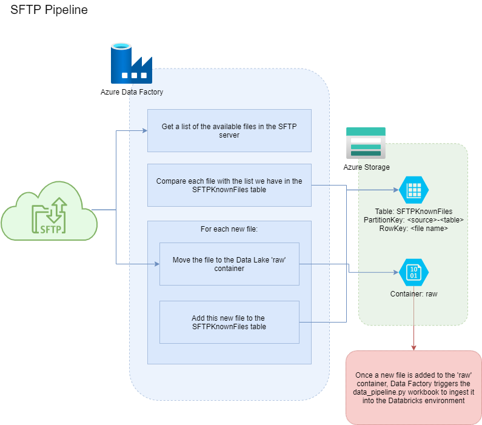

# Ingenii Azure Data Factory Generator Connections

Here we detail the different connection types that this package supports. Currently we only support pulling from FTP/SFTP sources, but this will be expanded.

## <a name="general_requirements"></a>General requirements

If not using the Ingenii Azure Data Platform, then there are some resources that need to be created ahead of using this package, as these are assumed to exist already. The below are used by all different pipelines.

Please note that you will only need to create the resources themselves, as all Data Factory objects are created by the package.

1. A [Key Vault](https://docs.microsoft.com/en-us/azure/key-vault/general/overview) where credentials and secrets are drawn from. 
    1. The package uses the Data Factory system-assigned managed identity to connect to the Key Vault.
    1. If using the `Vault access policy` permission model, please give the Data Factory `Get` credentials to the `Secrets` key vault type.
    1. If using the `Azure role-based access control` permission model, please give the Data Factory the [`Key Vault Secrets User`](https://docs.microsoft.com/en-us/azure/role-based-access-control/built-in-roles#key-vault-secrets-user) IAM role.
1. A [Data Lake](https://azure.microsoft.com/en-gb/services/storage/data-lake-storage) to host the retrieved data.
    1. In the Data Lake itself, a container called `raw` which the files will be copied to.
    2. Please grant the Data Factory system-assigned managed identity the [Storage Blob Data Contributor](https://docs.microsoft.com/en-us/azure/role-based-access-control/built-in-roles#storage-blob-data-contributor) IAM role.

## FTP/SFTP

### Requirements

As well as those listed in the [General requirements](#general_requirements), these are specific to the FTP/SFTP pipelines that should be created ahead of time:

1. Add to the data lake referenced by the linked service `Data Lake`:
    1. A table in table storage called `KnownSFTPFiles` where we keep track of which files have been processed
    1. A table called `Select1`, with an entry with PartitionKey `1` and RowKey `1`, for adding new entries to the `KnownSFTPFiles` table
1. Add to the key vault created in the general requirements:
    1. The server password as a secret, with the name you have given in the config JSON at `config.key_vault_secret_name`
    1. A [SAS token](https://docs.microsoft.com/en-us/azure/storage/common/storage-sas-overview) that grants access to the table storage in the data lake referenced by the linked service `Data Lake`.
        1. [Guide to creating a SAS token manually](https://docs.microsoft.com/en-us/azure/cognitive-services/translator/document-translation/create-sas-tokens?tabs=Containers)
        1. `Allowed services` should be restricted to `Table`
        1. `Allowed resource types` should be restricted to `Object`
        1. All possible permissions should be added
        1. Change the expiration data to be a long time in the future (e.g. 2100-01-01)
        1. Once the token is created, copy the `Table service SAS URL` version, which starts with `https://`
        1. Add this to the Key Vault with the secret name `datalake-table-storage-sas-uri`

### Example configuration
```
{
    "name": "example-data-provider",
    "connection": "ftp",
    "authentication": "basic",
    "self_hosted_integration_runtime": "adp-self-hosted",
    "config": {
        "host": "hostaddress.com",
        "username": "username-321",
        "key_vault_secret_name": "example-data-provider-password"
    },
    "schedule": {
        "frequency": "Day",
        "time": "06:00"
    },
    "tables": [
        {
            "name": "table1",
            "path": "/path1"
        }
    ]
}
```
| Key | Required | Description |
| --- | --- | --- |
| `name` | Yes | The name of the data provider that we are pulling data from. This will be used in naming Data Factory resources such as pipelines, and is the top-level folder name in the `raw` container in the data lake that the files will be copied to. |
| `connection` | Yes | The connection type to use, in this case either `ftp` or `sftp`. This will set which protocol is used and the default port the pipeline will connect to: `21` for `ftp` and `22` for `sftp`. The port can be overridden with the `custom_port` argument in the `config` block detailed below. |
| `authentication` | Yes | The authentication to be used to connect to the server. Currently only `basic` is supported. |
| `self_hosted_integration_runtime` | No | If we need to use a self-hosted integration runtime to connect to the remote server, for example to use a fixed IP address, then the name of the runtime to use should be given here, which needs to be created ahead of time. If this entry is not provided then an Azure-provided integration runtime will be used. |
| `config` | Yes | The configuration to connect to the remote server. |
| `config.hostname` | Yes | The hostname of the remote server. |
| `config.username` | Yes | The username to use to connect to the remote server. |
| `config.key_vault_secret_name` | Yes | The password to connect to is sensitive, so we cannot specify it here. Instead, we hold the password as a secret in an Azure Key Vault, and the pipeline obtains it at runtime: it will access a Key Vault linked service called `Credentials Store` (as described in the General Requirements section) and get the secret with the name specified here. |
| `schedule` | Yes | How often the pipeline will check the remote server. See the `Triggers` section below to see all the ways this can be configured. |
| `tables` | Yes | The list of tables that we should pull from the remote server into the data lake `raw` container. |
| `tables.name` | Yes | The name of the table the server files correspond to. This will both be the name of the table in the Databricks database, and part of the folder path in the data lake `raw` container that the files will be copied to: the full path will be `<data provider name>/<table name>`. |
| `tables.path` | Yes | The path on the remote server to draw files from. All files found at this path will be copied. Currently, there is no filtering configuration options and the search is non-recursive. |

### Process


